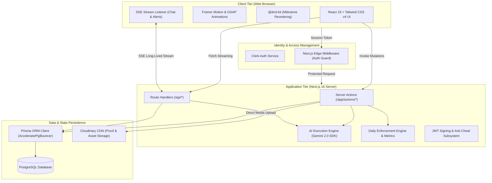
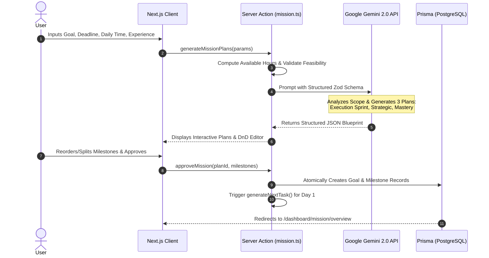
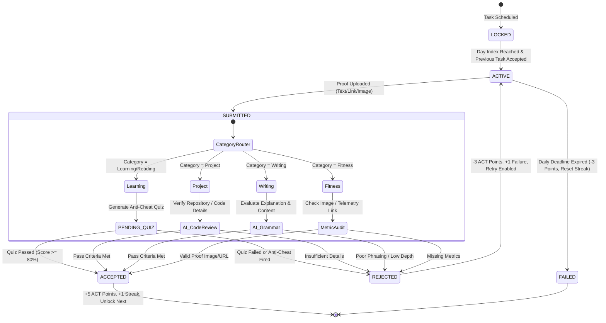
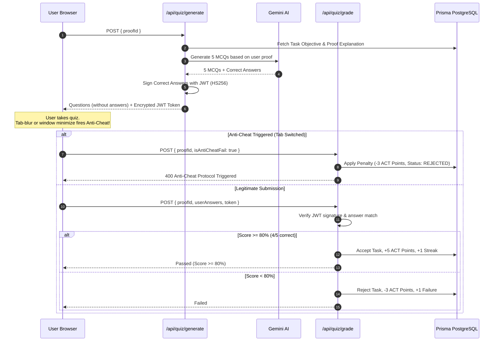
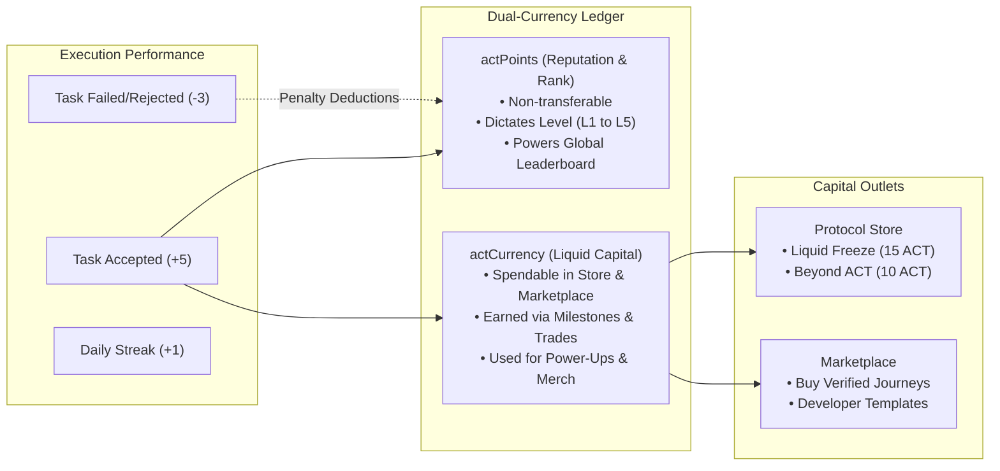

# Actify — Technical Architecture & System Design

This document provides an exhaustive, in-depth architectural breakdown of **Actify**, the AI Execution Operating System. It outlines the core subsystems, communication protocols, state machines, database transaction patterns, and AI pipelines.

---

## 1. High-Level System Architecture

Actify is built on modern full-stack web standards combining **Next.js 16 (App Router)** with server-side execution enforcement, deterministic AI validation via **Google Gemini**, and real-time push updates via **Server-Sent Events (SSE)**.



---

## 2. Core Subsystems

### 2.1 AI Execution Engine & Blueprint Pipeline

The AI engine converts abstract human intentions into concrete, structured, and sequentially enforced roadmaps.



#### Blueprint Generation Strategy
1. **Feasibility Analysis**: Calculates total available hours based on user's target deadline and stated daily availability:
   $$\text{Available Hours} = \left\lceil \frac{\text{Deadline} - \text{Today}}{86,400,000 \text{ ms}} \right\rceil \times \left( \frac{\text{Time Per Day}}{60} \right)$$
2. **Three Strategic Protocols**:
   - **Execution Sprint**: High velocity, compressed timeline, high intensity.
   - **Strategic Execution**: Balanced pacing with structured milestones and moderate risk buffers.
   - **Mastery Protocol**: Comprehensive depth, maximum rigor, and zero compromise on foundational prerequisites.
3. **Structured Output Enforcement**: Validated against `MultiplePlansResponseSchema` to guarantee strict JSON output conforming to typed milestone structures.

---

### 2.2 Proof-of-Work Verification Engine

Actify eliminates subjective self-reporting by validating proof through category-specific verification pipelines.



#### Verification Categories
- **`Learning` / `Reading` / `Research`**: Routes to `PENDING_QUIZ`. The system calls `/api/quiz/generate` to synthesize 5 rigorous Multiple-Choice Questions (MCQs) directly from the user's explanation and task objective. Answers are encrypted in a signed JWT token sent to the client.
- **`Project`**: Routes to automated code review heuristics checking commit evidence, architectural explanation depth, and repository URLs.
- **`Writing`**: Evaluates syntactical coherence, vocabulary depth, and structural completion against minimum length constraints.
- **`Fitness`**: Enforces verifiable telemetry (workout tracker screenshot, GPS pace graph, or wearable metric link).

---

### 2.3 Anti-Cheat Quiz Architecture

To guarantee the authenticity of user learning, Actify implements an anti-cheat quiz pipeline:



---

### 2.4 Real-Time SSE Streaming Infrastructure

Rather than utilizing heavyweight WebSocket daemons, Actify implements **HTTP Server-Sent Events (SSE)** via Next.js Route Handlers (`/api/chat/stream`).

#### Key Characteristics
1. **Clerk Token Verification**: Authenticates connection using `getAuth(request)`.
2. **Native `ReadableStream`**: Emits events to browser clients with low latency and automatic backpressure management.
3. **Multi-Channel Dispatch**: Interleaves direct peer-to-peer messages (`Message`) and collaborative guild messages (`GroupMessage`).
4. **Heartbeat & Reconnection**: Periodic polling check against high-watermark timestamps (`lastCheck`).

---

### 2.5 Dual-Currency Economic Subsystem



---

## 3. Database Transaction & Concurrency Model

All operations altering user points, streaks, or task states execute inside atomic **Prisma transactions** (`prisma.$transaction`).

```typescript
// Pattern: Atomic Proof Verification and Level/Currency Settlement
await prisma.$transaction(async (tx) => {
    // 1. Update Proof Record
    await tx.proof.upsert({
        where: { taskId },
        create: { taskId, content, explanation, reviewStatus: "ACCEPTED" },
        update: { content, explanation, reviewStatus: "ACCEPTED" }
    });

    // 2. Transition Task State
    await tx.task.update({
        where: { id: taskId },
        data: { state: "ACCEPTED" }
    });

    // 3. Increment User Progression & Points Atomically
    await tx.user.update({
        where: { id: userId },
        data: {
            streak: { increment: 1 },
            actPoints: { increment: 5 },
            tasksCompleted: { increment: 1 },
            lastCompletionDate: new Date(),
            dailyTaskCompleted: true
        }
    });
});
```

This guarantees:
- **Zero Drift**: Points and completion counts never fall out of sync with task states.
- **Race Resistance**: Multiple submissions or concurrent webhooks cannot duplicate rewards or double-consume power-ups.
- **Audit Consistency**: Daily deadline enforcement (`checkDailyFailure`) seamlessly falls back on `lastCompletionDate` timestamps.

---

## 4. Performance & Deployment Architecture

- **Static Generation & Dynamic Edge Routing**: Static landing pages with dynamic, session-authenticated dashboard routes.
- **Font & Asset Optimization**: Vercel `@next/font` with Geist Sans and Geist Mono font sub-setting.
- **Image Pipeline**: Cloudinary CDN dynamic resizing and caching with base64 image optimization.
- **Database Connection Pooling**: PostgreSQL session pooling via PgBouncer (`POSTGRES_PRISMA_URL`) alongside direct migration connections (`POSTGRES_URL_NON_POOLING`).
